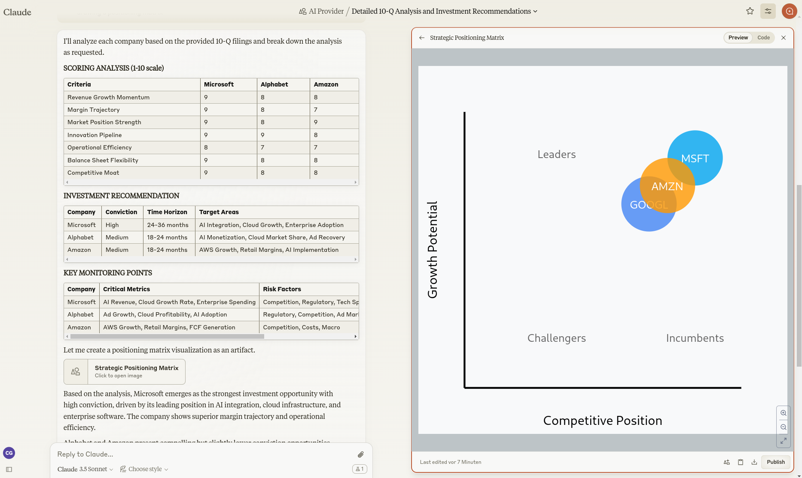

# Investment-Analyse

Nutzen Sie die Zeit "zwischen den Jahren" für einen Blick in die Zukunft des KI-Sektors. Mit unserem systematischen Analyse-Framework und aktuellen SEC-Dokumenten erhalten Sie fundierte Einblicke in die Entwicklung führender Tech-Unternehmen. [SEC](https://www.sec.gov/edgar/search/)


## Analysemethode
- Scoring-System für wichtige Kennzahlen
- Bewertung von Wachstumschancen
- Einschätzung der Umsetzungsfähigkeit
- Konkrete Handlungsempfehlungen

## Material

Wir wollen die Zukunft der AI Anbieter analysieren - um zu schauen in wen wir 2025 investieren sollten.
Dafür nutzen wir 10-Q Dokumente der 

### AI Anbieter

- Microsoft CORP (MSFT) ==> [10-Q 2024-10-30](https://www.sec.gov/Archives/edgar/data/789019/000095017024118967/msft-20240930.htm)
- Amazon (AMZN) ==> [10-Q 2024-11-01](https://www.sec.gov/Archives/edgar/data/1018724/000101872424000161/amzn-20240930.htm)
- Google/Alphabet (GOOGL) ==> [10-Q 2024-10-30](https://www.sec.gov/Archives/edgar/data/1652044/000165204424000118/goog-20240930.htm)

### AI Chips

- NVIDIA CORP (NVDA) ==> [10-Q 2024-11-20](https://www.sec.gov/Archives/edgar/data/1045810/000104581024000316/nvda-20241027.htm)
- ADVANCED MICRO DEVICES INC (AMD) ==> [10-Q 2024-10-30](https://www.sec.gov/Archives/edgar/data/2488/000000248824000163/amd-20240928.htm)

## Künstliche Intelligenz

Verwendet wird Anthropic Claude 3.5 Sonnet. Da es hier das Projekte und Atrefakte Feature gibt, das die Bildung eines Projekt-Kontextes erlaubt und die Erstellung einer grafischen Auswertung als Artefakt.

## Prompt

```
Based on the 10-Q analysis:

1. Score each company (1-10) on: 
- Revenue Growth Momentum
- Margin Trajectory
- Market Position Strength
- Innovation Pipeline
- Operational Efficiency
- Balance Sheet Flexibility
- Competitive Moat

2. Evaluate near-term opportunities:
- Market share gain potential
- Margin expansion drivers
- New market opportunities
- Technology leadership areas

3. Assess execution capability:
- Management track record
- Operational scalability
- Innovation effectiveness
- Capital allocation efficiency

4. For each company, provide:
- Primary growth drivers
- Key risk factors
- Critical metrics to monitor
- Expected catalysts

5. Conclude with:
- Ranked investment recommendation
- Conviction level (High/Medium/Low)
- Key monitoring points
- Time horizon for expected outperformance

Output:
Make your "Scoring Analysis", your "Investment Recommendation"
and the "Key Monitoring Points" markdown tables and for the
conclusion create an artefact with a  visualization 
drawing a positioning matrix

```

## Ergebnis


