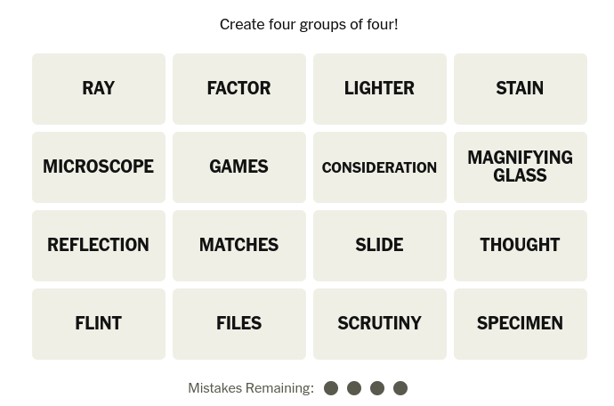

# Connections



Trainieren Sie Ihr Assoziationsvermögen mit dem New York Times Spiel [Connections](https://www.nytimes.com/games/connections)
. 

Die KI hilft beim Lösen kniffliger Verbindungen und erklärt die Zusammenhänge. 


## Künstliche Intelligenz

Beliebig

## Prompt

```

Solve the puzzle by building 4 groups with 4 words each. 
Think about different meanings to group them or slang 
or sound or their uses as pre- or postfix to other words.

```