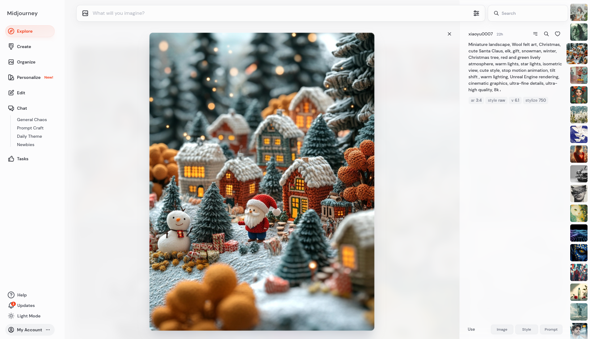
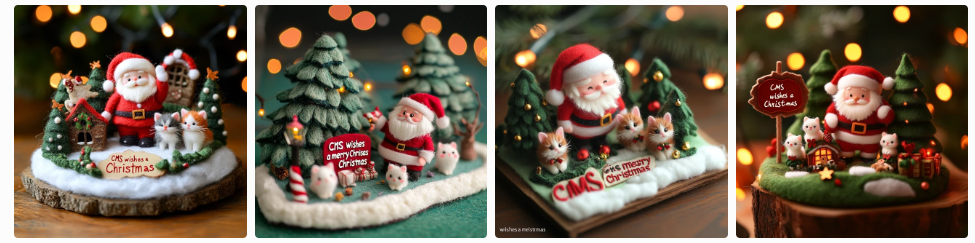
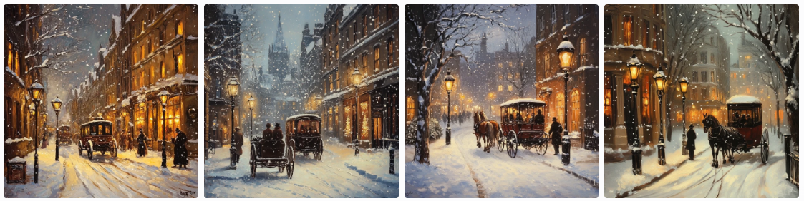
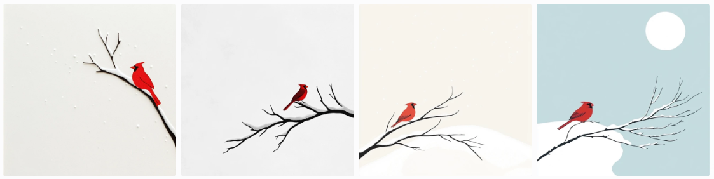
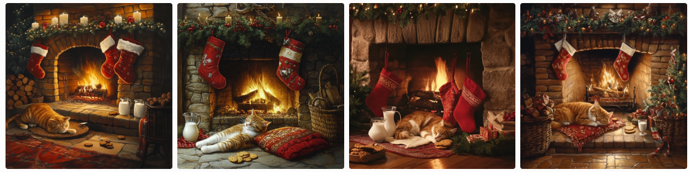
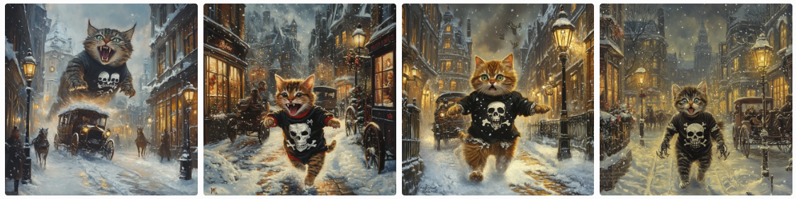
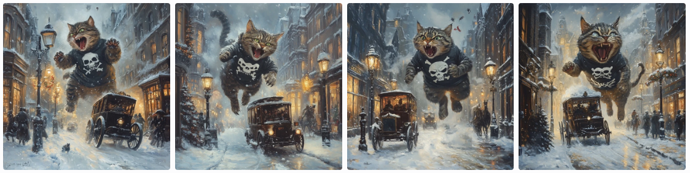

# Grußkarten

Bildgenerierende KI-Systeme eröffnen völlig neue Möglichkeiten für persönliche Weihnachtsgrüße. Mit der richtigen Anleitung entstehen professionell aussehende Karten, die Ihre persönliche Note tragen.

## Wie funktioniert's?

Die Kunst liegt im "Prompt" - der Beschreibung dessen, was die KI erzeugen soll. Mit unserer bewährten Formel gelingen auch Einsteigern beeindruckende Ergebnisse.

## Künstliche Intelligenzen



- <mark>https://www.midjourney.com/</mark>
- https://openai.com/index/dall-e-3/
- https://ideogram.ai/
- https://stability.ai/
- https://blackforestlabs.ai/
- https://www.adobe.com/products/firefly/features/text-to-image.html
- https://www.istockphoto.com/ai/generation/create


## Formel

<div style="background-color:#eee; border-radius:50px; font-family:monospace; font-size: 24px; padding:30px; margin: 20px">
<mark>Anlass</mark> + <mark>Style</mark> + <mark>Schlüsselelemente</mark> + <br>
<mark>Athmosphäre</mark> + <mark>Text</mark> +  <mark>technische Anforderungen</mark>  
</div>

<div>
<b>Anlass</b>: Weihnachtskarte,<br>
<b>Style</b>: künstlerischer Stil (Werkstoff, Richtung, Künstler)<br>
<b>Schlüsselelemente</b>: Liste der Motiv-Elemente oder des Motivs<br>
<b>Athmosphäre</b>: Stimmung (nostalgisch, romantisch, modern)
<b>Text</b>: Kartenbeschriftung (immer in Anführungszeichen!)
<b>technische Anforderungen</b>: Aspect Ratio, Model Version, etc
</div>


## Prompt

```

miniature landscape, wool felt art, christmas, 
cute Santa Claus, 3 kittens, winter, red and 
green lively atmosphere, star lights, isometric 
view, tilt shift, warm lighting, ultra-fine 
details, ultra-high quality, text "Merry Christmas"

```

## Ergebnis



-----


## Weitere Beispiel Prompts



```
Christmas greeting card, snowy Victorian London street, horse-drawn 
carriage, gas lamps, romantic nostalgic mood, oil painting style
```

---



```
Christmas greeting card, modern minimalist design, single red cardinal 
on snow-covered branch, white space for text, elegant simplicity
```

---


```
Christmas greeting card, cozy fireplace scene with stockings, 
sleeping cat, milk and cookies, warm intimate lighting, 
Norman Rockwell style
```

---


```
Christmas greeting card like a movie poster with a godzilla size 
kitten in a skull and bones t-shirt on a rampage in a snowy 
Victorian London street, horse-drawn carriage, gas lamps, 
romantic nostalgic mood, oil painting style
```

---


("Vary Strong" auf Bild #1)
